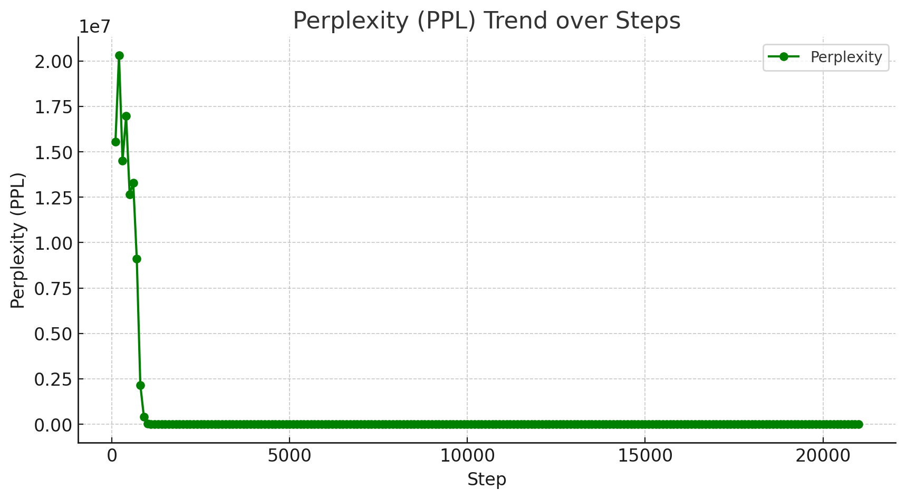
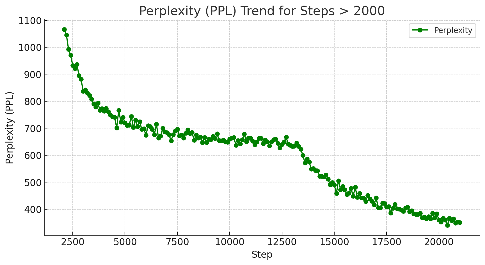

# LoRA-Jittor

人工神经网络大作业<br>
"LoRA: Low-Rank Adaptation of Large Language Models" 论文复现

## 项目框架

这个仓库包含几个目录：
* [src/](src) 包含用于数据处理、训练和解码的源代码。
* [eval/](eval) 包含任务特定的评估脚本的代码。
* [data/](data) 包含我们在实验中使用的原始数据。
* [vocab/](vocab) 包含GPT-2的词汇文件。
* [figures/](figures) readme.md对应的图片

## 特别说明
* 目前模型的读取存在问题，初始的ppl过高，仿佛没有成功加载模型，实际训练效果如下图所示：


* 由于读取问题，jittor实现的gpt2_beam也存在相应问题，无法把模型调优后的模型读取，只能输出全是控制的预测jsonl。因此在实际实验的过程中，我将jittor调优后的模型参数输入pytorch框架的gpt2_beam进行模型性能评估。
* 由于设备限制，实现中没有把jittor分布式运行复现，可参考jittor官网关于mpi的部分和论文原仓库，在响应位置加上if jt.rank == 0，防止死锁。

## 执行
参考论文原github repo: https://github.com/microsoft/LoRA.

0. Install dependencies in a virtual environment
```
 sudo apt-get update
 sudo apt-get -y install git jq virtualenv
 git clone https://github.com/NNN-del/LoRA-Jittor.git; cd LoRA-Jittor
 virtualenv -p `which python3` ./venv
 . ./venv/bin/activate
 pip install -r requirement.txt
 bash download_pretrained_checkpoints.sh
 bash create_datasets.sh
 cd ./eval
 bash download_evalscript.sh
 cd ..
 ```
 除此之外还需要根据jittor仓库配置jittor:https://cg.cs.tsinghua.edu.cn/jittor/download/
```
sudo apt install python3.7-dev libomp-dev
python3.7 -m pip install jittor
python3.7 -m jittor.test.test_example
# 如果您电脑包含Nvidia显卡，检查cudnn加速库
python3.7 -m jittor.test.test_cudnn_op
```
#### 个人运行经验
在个人运行过程中，租用了云计算的服务器，配置如下：
Ubuntu18.04, Python 3.8, CUDA 11.3, cuDNN 8, NVCC, Pytorch 1.11.0, torchvision 0.12.0, torchaudio 0.11.0，在此基础上配置jittor和tensorboardX，下载对应数据，即可正常运行训练代码。

1. Train GPT-2 Medium with LoRA
```
python -m torch.distributed.launch --nproc_per_node=1 src/gpt2_ft.py \
    --train_data ./data/train.jsonl \
    --valid_data ./data/valid.jsonl \
    --train_batch_size 8 \
    --grad_acc 1 \
    --valid_batch_size 4 \
    --seq_len 512 \
    --model_card gpt2.md \
    --init_checkpoint ./pretrained_checkpoints/gpt2-medium-pytorch_model.bin \
    --platform local \
    --clip 0.0 \
    --lr 0.0002 \
    --weight_decay 0.01 \
    --correct_bias \
    --adam_beta2 0.999 \
    --scheduler linear \
    --warmup_step 500 \
    --max_epoch 5 \
    --save_interval 1000 \
    --lora_dim 4 \
    --lora_alpha 32 \
    --lora_dropout 0.1 \
    --label_smooth 0.1 \
    --work_dir ./trained_models \
    --random_seed 110
```

2. Generate outputs from the trained model using beam search:
```
python  src/gpt2_beam.py \
    --data ./data/e2e/test.jsonl \
    --batch_size 1 \
    --seq_len 512 \
    --eval_len 64 \
    --model_card gpt2.sm \
    --init_checkpoint ./trained_models/GPT2_S/e2e/model.26289.pkl \
    --lora_dim 4 \
    --lora_alpha 32 \
    --beam 10 \
    --length_penalty 0.8 \
    --no_repeat_ngram_size 4 \
    --repetition_penalty 1.0 \
    --eos_token_id 628 \
    --work_dir ./trained_models/GPT2_S/e2e \
    --output_file predict.26289.b10p08r4.jsonl
```

3. Decode outputs from step (2)
```
python src/gpt2_decode.py \
    --vocab ./vocab \
    --sample_file ./trained_models/predict.26289.b10p08r4.jsonl \
    --input_file ./data/test_formatted.jsonl \
    --output_ref_file e2e_ref.txt \
    --output_pred_file e2e_pred.txt
```

4. Run evaluation on E2E test set

```
python eval/e2e/measure_scores.py e2e_ref.txt e2e_pred.txt -p
```

## Reference

https://arxiv.org/abs/2106.09685<br>
https://github.com/microsoft/LoRA